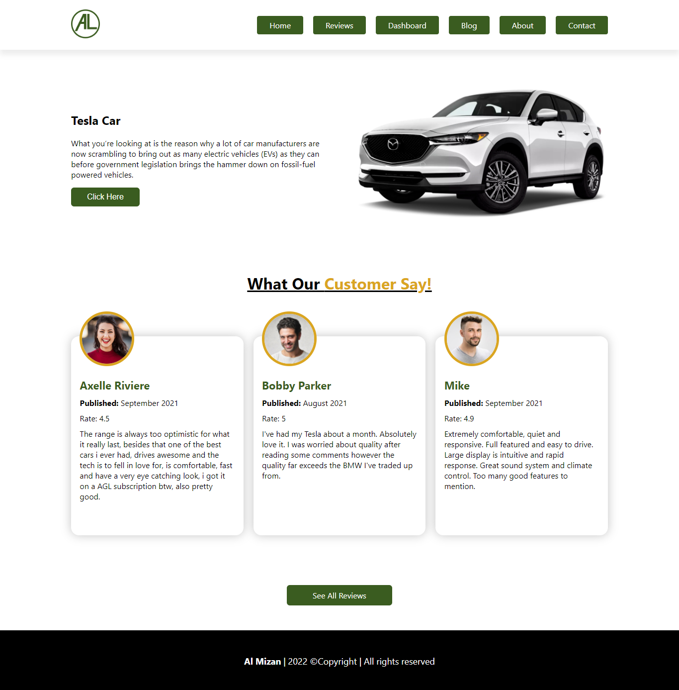
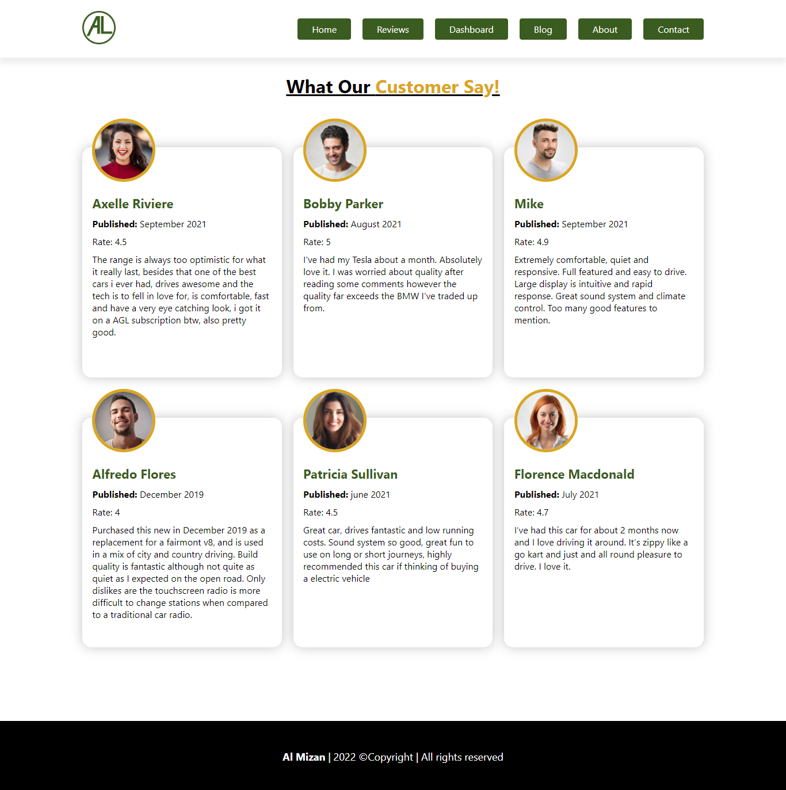
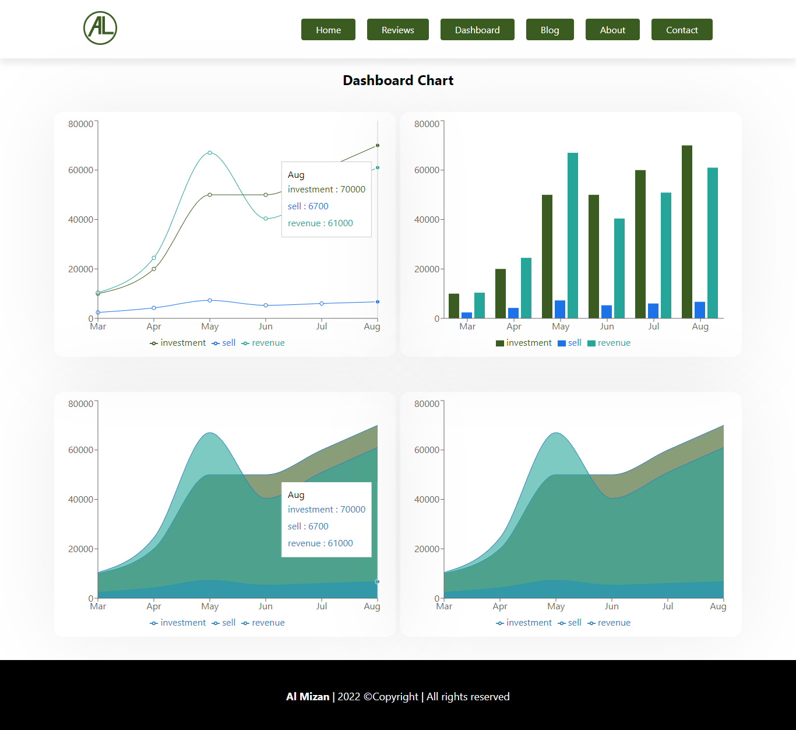

# Al Mizan Store

**Live site link:** [https://transcendent-gaufre-331a75.netlify.app/](https://transcendent-gaufre-331a75.netlify.app/)

1.  This site I have used react and react router
2.  Tesla Car Details
3.  Customer Reviews
4.  There are six review on the reviews page and three review on the home page
5.  There are four charts on the dashboard
    - Line chart
    - Bar Chart
    - Area Chart
6. The website has a total of seven pages
    - Home
    - Reviews
    - Dashboard
    - Blog
    - About
    - Contact
    - 404 page

**Home page:** 

**Reviews page:** 

**Dashboard page:** 
